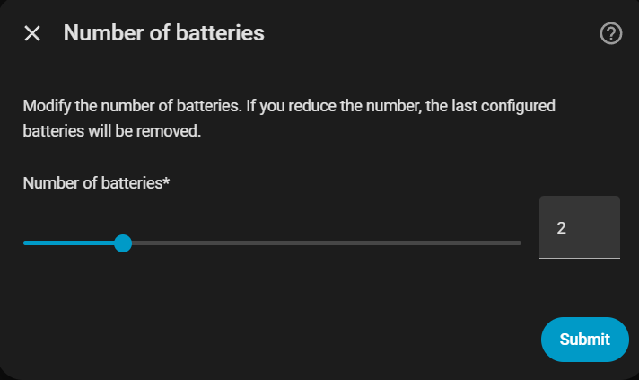
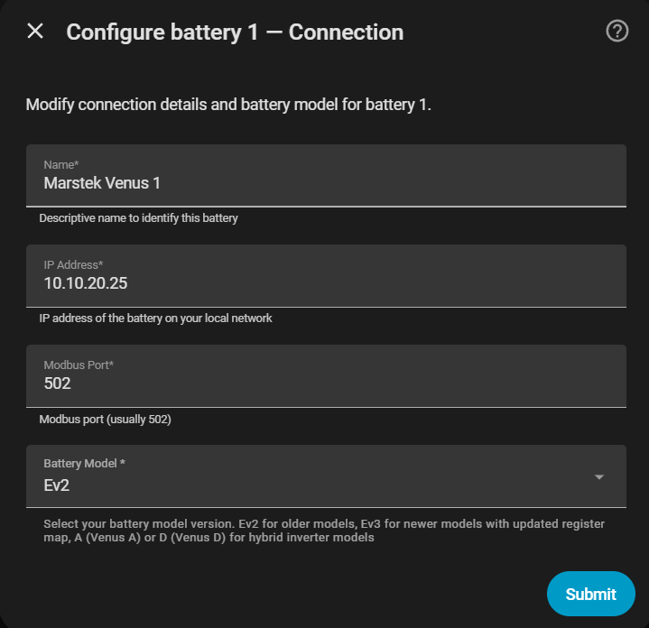
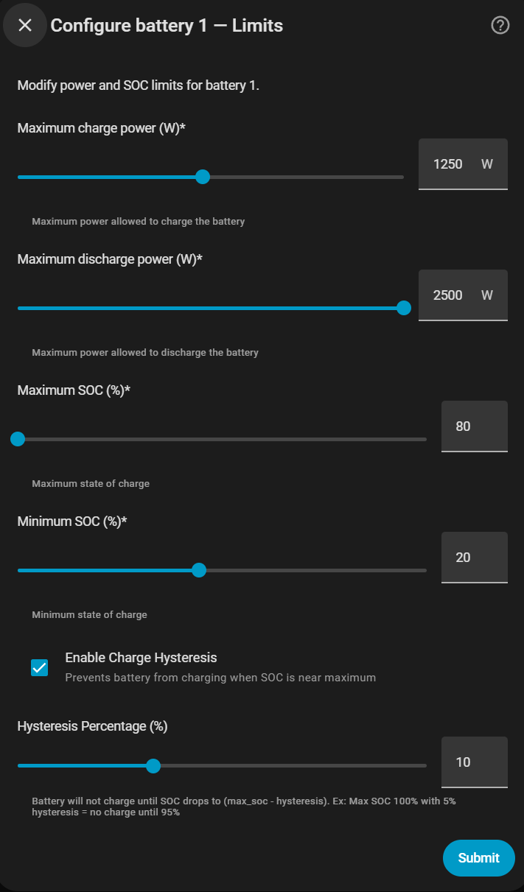
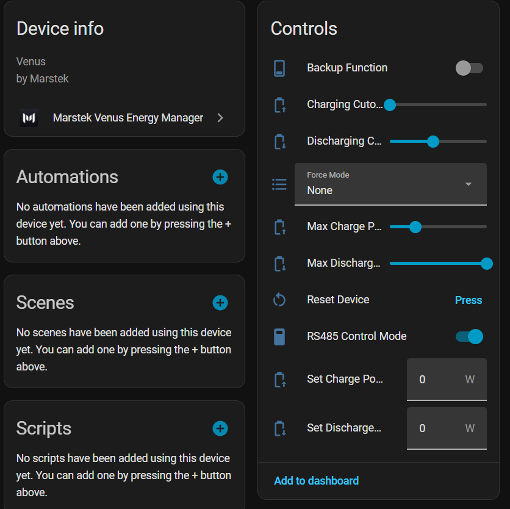

# Configuración de baterías

## Número de baterías

Selecciona cuántas unidades Marstek Venus tienes (1–6). La integración te pedirá configurar cada una por separado.

{ width="650"  style="display: block; margin: 0 auto;"}

---

## Parámetros por batería

| Parámetro | Descripción | Valor por defecto |
|---|---|---|
| **Nombre** | Nombre identificativo (p. ej. "Venus 1") | — |
| **Host** | IP del conversor Modbus TCP | — |
| **Puerto** | Puerto TCP Modbus | `502` |
| **Versión** | Modelo de la batería | — |
| **Potencia máx. carga/descarga** | Potencia nominal de la instalación | — |
| **SOC máximo** | Detiene la carga al alcanzar este % | `100 %` |
| **SOC mínimo** | Detiene la descarga al alcanzar este % | `12 %` |
| **Histéresis de carga** | Margen para evitar ciclos rápidos cerca del límite | — |

### Versiones de batería

| Versión | Modelos |
|---|---|
| `v1/v2` | Venus E v1, Venus E v2 |
| `v3` | Venus E v3 |
| `vA` | Venus A |
| `vD` | Venus D |

!!! warning "Potencia máxima 2500 W"
    Usa el modo **2500 W** solo si tu instalación doméstica puede soportar esa potencia de forma segura.

{ width="650"  style="display: block; margin: 0 auto;"}
{ width="650"  style="display: block; margin: 0 auto;"}

---

## SOC y límites de potencia en tiempo de ejecución

Los valores de SOC máximo/mínimo y potencia máxima de carga/descarga se pueden ajustar en cualquier momento desde los sliders de la integración sin necesidad de reconfigurar. Los cambios se persisten y se restauran en cada reinicio de Home Assistant.

{ width="650"  style="display: block; margin: 0 auto;"}
