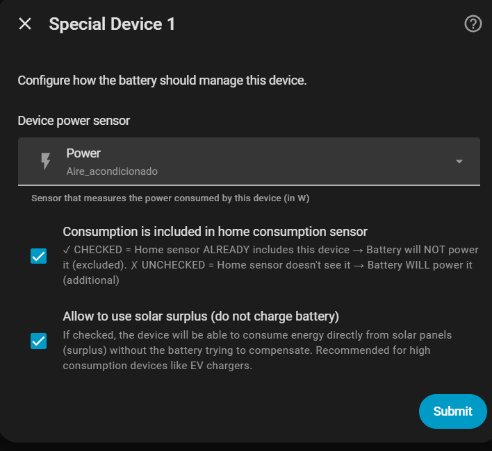

# Excluded devices

Allows you to "mask" heavy loads so the battery does not try to cover them.

## Typical use case

If you have a 7 kW EV charger and a 2.5 kW battery, without exclusion the battery will try to compensate the full charger load and drain quickly. With exclusion active, the controller ignores that power and the battery only manages the rest of the household.

---

## Configuring an excluded device

| Field | Description |
|---|---|
| **Power sensor** | HA entity measuring the device's power (e.g. `sensor.wallbox_power`) |
| **Included in consumption** | Check if your main sensor **already** includes this load |
| **Allow solar surplus** | If enabled, the battery will not charge to compensate this device when there is a solar surplus |

### Included in consumption?

```
Main sensor reads: whole house
EV charger is part of "whole house" → ✅ Included in consumption

Main sensor reads: only domestic circuit
EV charger is on a separate circuit → ❌ Not included in consumption
```

The integration uses this setting to correctly calculate the net consumption without the excluded device.

{ width="650"  style="display: block; margin: 0 auto;"}
