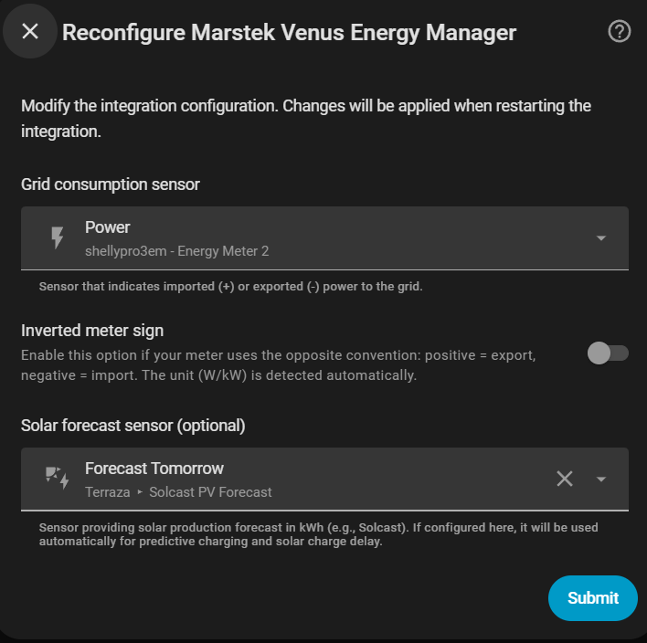

# Sensor principal

El primer paso configura las fuentes de datos globales de la integración.

## Sensor de consumo de red

Sensor de Home Assistant que mide el intercambio de potencia con la red (en **W** o **kW**).

!!! tip "Sensores compatibles"
    Cualquier sensor que exponga la potencia de red funciona: Shelly EM, Shelly EM3, Neurio, integraciones de contador inteligente (e.g. `sensor.grid_power`).

!!! warning "Frecuencia de actualización"
    El sensor debe actualizarse lo más rápido posible. El controlador opera cada **2,5 segundos** y toma decisiones basadas en la última lectura disponible — cuanto más antigua sea la lectura, menos precisa será la respuesta.

    El consumo del hogar puede variar varios kilovatios en fracciones de segundo (arranque de electrodomésticos, horno, lavadora…). Un sensor que reporta cada 10 segundos o más introduce un desfase que hace que el controlador reaccione a una situación que ya no existe, provocando sobreoscilaciones o correcciones innecesarias.

    **Recomendado: actualización cada 1–2 segundos.** Los dispositivos como Shelly EM/EM3 soportan este intervalo de forma nativa.

### Detección automática de kW

Si el atributo `unit_of_measurement` del sensor es `kW`, la integración multiplica el valor por 1000 automáticamente.

### Signo invertido

Activa **"Signo del medidor invertido"** si tu sensor usa la convención opuesta:

| Convención | Importación | Exportación |
|---|---|---|
| Estándar (por defecto) | Valor positivo | Valor negativo |
| Invertida | Valor negativo | Valor positivo |

Déjalo desactivado si no estás seguro.

---

## Sensor de previsión solar *(opcional)*

Sensor que proporciona la producción solar estimada para mañana, en **kWh** o **Wh**.

Configurarlo aquí lo pone a disposición de:

- **Carga predictiva** (modos Franja Horaria y Precio Dinámico)
- **Retraso de carga solar**

También puedes dejarlo en blanco y configurarlo más tarde en esas secciones específicas.

{ width="600"  style="display: block; margin: 0 auto;"}