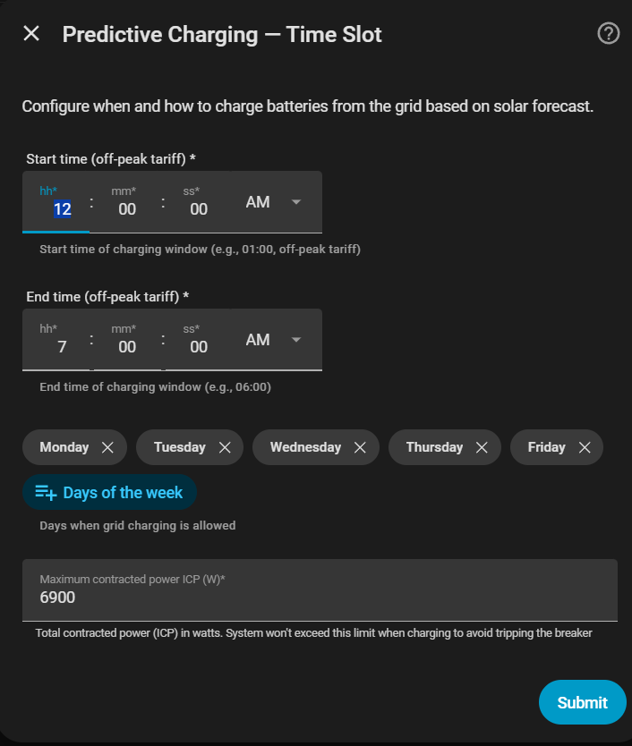

# Carga predictiva — Modo Franja Horaria

Carga desde la red durante una **ventana horaria fija** (típicamente tarifa nocturna barata).

## Configuración

| Campo | Descripción |
|---|---|
| **Ventana horaria** | Inicio y fin de la franja de carga (p. ej. `02:00` – `05:00`) |
| **Sensor de previsión solar** | Sensor de producción del día siguiente en kWh (opcional) |
| **Potencia ICP contratada** | Límite de la conexión de red (W). Asegura que carga + consumo doméstico no supere el ICP |

!!! note "Sin sensor solar"
    Si no tienes paneles solares, deja vacío el sensor de previsión. El sistema cargará siempre que la energía de la batería sea insuficiente para cubrir el consumo esperado.

{ width="650"  style="display: block; margin: 0 auto;"}

## Flujo de evaluación

1. **1 hora antes** del inicio del slot: evaluación preliminar con notificación.
2. **Al inicio del slot**: confirmación final y arranque de la carga.
3. La carga continúa hasta que la batería alcanza el nivel calculado o finaliza la ventana.

## Reevaluación a mitad del día

Cuando hay varios slots baratos seleccionados, el sistema reevalúa **1 hora antes de cada slot** si la carga sigue siendo necesaria. Si la batería ya tiene suficiente energía (solar + SOC actual cubre el consumo), el slot se omite silenciosamente.
