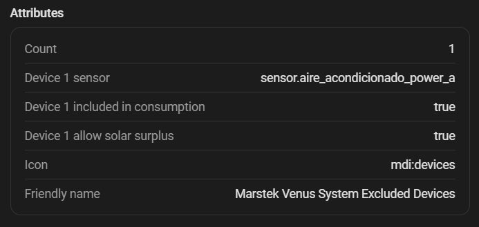

# Exclusión de cargas

Ver [Dispositivos excluidos](../configuration/excluded-devices.md) para la configuración.

## Cómo funciona internamente

Cuando un dispositivo excluido está activo, el controlador resta su potencia del consumo de red antes de calcular el ajuste del controlador PD:

```
consumo_efectivo = consumo_red - potencia_excluida
error = consumo_efectivo - target_grid_power
```

Esto hace que la batería "ignore" esa carga y no intente compensarla.

### Si el dispositivo NO está incluido en el sensor principal

La integración **suma** la potencia del dispositivo excluido al consumo de red medido (porque el sensor principal no la ve) y luego la resta, resultando en el mismo consumo efectivo neto.

## Opción "Permitir excedente solar"

Cuando está activa, si el sistema opera con excedente solar (la batería está cargando por excedente), la exclusión no se aplica para la parte de carga. En otras palabras: la batería no cargará para compensar el consumo de este dispositivo cuando ya hay excedente solar disponible.

{ width="700"  style="display: block; margin: 0 auto;"}
