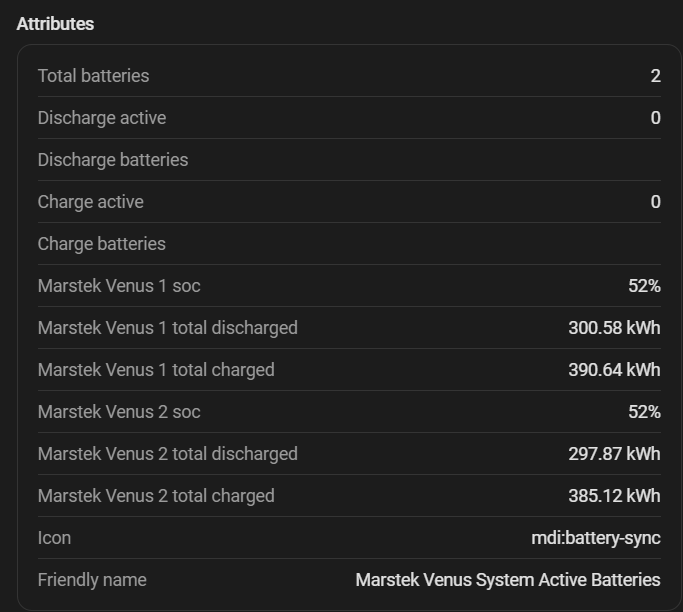

# Multi-battery management

The integration manages up to **4 batteries** as an aggregated system, distributing power intelligently to maximise efficiency.

## Efficiency principle

Based on the Venus efficiency curve (peak ~91% between 1000–1500 W), batteries are activated only when total power exceeds **60% of combined capacity**. Running fewer batteries at higher power is more efficient than spreading the same load across all of them.

## Selection priorities

### Discharge

**Highest SOC first**: the most charged battery discharges first to balance the state of charge across the system.

### Charging

**Lowest SOC first**: the least charged battery receives energy first.

## Hysteresis

To avoid "ping-pong" activation/deactivation, three hysteresis levels are applied:

| Hysteresis | Value | Description |
|---|---|---|
| **SOC** | 5 % | An active battery stays active until another exceeds it by 5% SOC |
| **Lifetime energy** | 2.5 kWh | Breaks SOC ties using accumulated lifetime energy with an advantage for the active battery |
| **Power** | ±100 W | Activates the 2nd battery at 60% of combined capacity; deactivates at 50% |

## Power distribution

Once active batteries are selected, the total power calculated by the [PD controller](pd-controller.md) is distributed among them proportionally, respecting each battery's individual power and SOC limits.

## Compatible modes

Multi-battery distribution applies in all modes:
- Normal PD control
- Solar charging
- Predictive grid charging

{ width="700"  style="display: block; margin: 0 auto;"}
