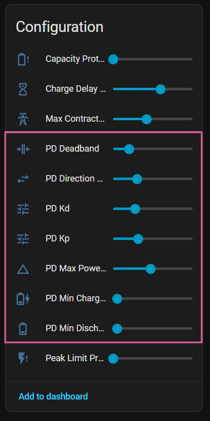

# Controlador PD

El controlador PD (Proporcional-Derivativo) es el núcleo de la integración. Se ejecuta cada **2,5 segundos** y ajusta la potencia de la batería para mantener el flujo de red cercano al objetivo configurado (por defecto, 0 W).

## Algoritmo

```
error = grid_power - target_power

P = Kp × error
D = Kd × (error - error_anterior) / dt

ajuste = P + D
nueva_potencia = potencia_actual + ajuste
```

### Parámetros por defecto

| Parámetro | Valor | Descripción |
|---|---|---|
| `Kp` | `0.65` | Ganancia proporcional |
| `Kd` | `0.5` | Ganancia derivativa |
| Deadband | `±40 W` | Zona muerta: ignora errores pequeños |
| Rate limit | `±500 W/ciclo` | Límite de cambio por ciclo |

## Mecanismos de estabilización

### Deadband (zona muerta)

Si el error es menor de ±40 W, el controlador no ajusta la potencia. Evita micro-oscilaciones continuas por ruido del sensor.

### Rate limiting

El cambio de potencia se limita a ±500 W por ciclo para suavizar las transiciones y proteger la batería de cambios bruscos.

### Detección de oscilaciones

El controlador monitoriza reversiones de dirección (carga↔descarga) frecuentes. Si detecta oscilación sostenida, reduce temporalmente la ganancia efectiva.

### Histéresis direccional

Evita cambios de dirección por variaciones de carga momentáneas (como el arranque de electrodomésticos). El controlador requiere que el error supere un umbral durante varios ciclos antes de cambiar de carga a descarga o viceversa.

## Potencia objetivo por franja

Cada [franja horaria](../configuration/time-slots.md) puede tener su propia **potencia objetivo de red** (`target_grid_power`), permitiendo distintas estrategias según el momento del día.

{ width="700"  style="display: block; margin: 0 auto;"}
