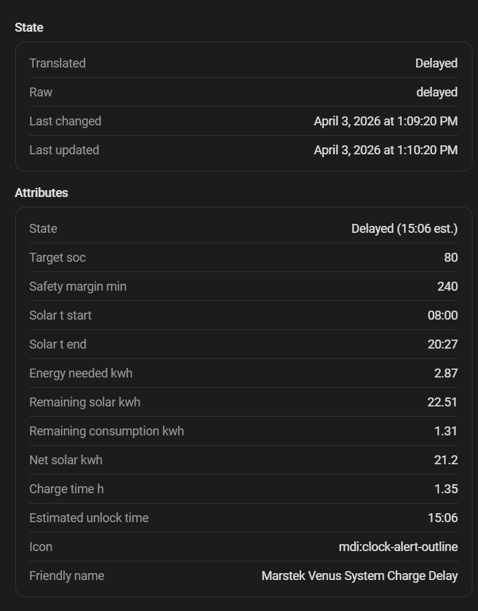

# Retraso de carga solar

Retrasa la carga matutina de la batería (tanto solar como desde la red) mientras la producción solar prevista sea suficiente para cubrir la energía necesaria. Evita cargar la batería a primera hora —ya sea con solar o con red— cuando el sol podrá hacerlo más tarde.

## Aplicación

- Carga matutina normal (cuando la batería se ha descargado durante la noche).
- Carga semanal al 100 % (espera a que el sol complete la carga antes de recurrir a la red).

## Modelo solar

La integración usa un **modelo sinusoidal** basado en la previsión nocturna almacenada para estimar la producción solar hora a hora a lo largo del día. Compara la producción acumulada esperada desde la hora actual hasta el anochecer con la energía que falta por cargar.

```
Si producción_solar_restante >= energía_a_cargar:
    Esperar (el sol lo cargará)
Si no:
    Iniciar carga (solar o desde la red)
```

## Previsión nocturna almacenada

Cada noche, la integración guarda la previsión solar del día siguiente. Esta previsión almacenada se usa durante todo el día siguiente para el modelo de retraso, garantizando una estimación coherente incluso si el sensor de previsión cambia durante el día.

## SOC de arranque del retraso

Un SOC de setpoint opcional (12–90 %, desactivado por defecto) divide la carga en dos fases:

1. **Por debajo del setpoint** — la batería carga libremente (solar y red), el retraso está inactivo. Estado del sensor: `Charging to setpoint`.
2. **En el setpoint o por encima** — se activa la lógica de retraso solar y decide si continuar cargando o esperar.

Esto es útil cuando la batería está muy descargada y necesita un mínimo garantizado antes de que entre en juego la decisión solar. Por ejemplo, con un setpoint del 50 % la batería carga hasta el 50 % sin restricciones; a partir de ahí, el sistema evalúa si la producción solar restante es suficiente para completar la carga y espera si lo es.

El setpoint se habilita con un checkbox independiente en la configuración. Si está desactivado, el retraso aplica desde el primer momento de carga. El valor mínimo es el 12 %, correspondiente al SOC mínimo de descarga de las baterías Venus.

## Requisitos

- Sensor de previsión solar configurado en el [paso inicial](../configuration/main-sensor.md).

{ width="650"  style="display: block; margin: 0 auto;"}
