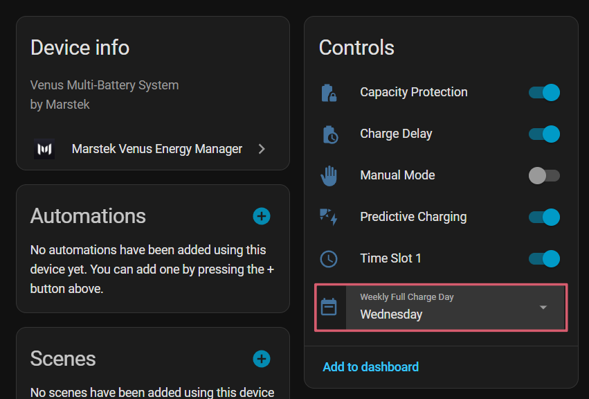

# Carga semanal completa

Carga las baterías al **100 % una vez por semana** para equilibrar las celdas y mantener la salud de la batería (cell balancing).

## Comportamiento

1. El día configurado de la semana, si el SOC máximo habitual es inferior al 100 %, la integración eleva temporalmente el límite de corte de carga al 100 %.
2. La batería carga hasta que todas las baterías disponibles alcanzan el 100 % de SOC o el BMS corta claramente la carga cerca de la parte alta.
3. Una vez alcanzada la parte alta, la integración inicia balanceo activo en lugar de volver inmediatamente al SOC máximo configurado.
4. El balanceo activo usa el perfil por tensión de celda documentado en [Monitor de equilibrio de celdas](cell-balance-monitor.md): microciclos de 90 W de carga, 30 W de carga de mantenimiento y 30 W de descarga.
5. La carga semanal mantiene el balanceo activo durante 4 horas.
6. Tras finalizar, el límite de SOC máximo vuelve automáticamente al valor configurado por el usuario.

Si los datos de tensión de celda no están disponibles para una batería durante la fase de balanceo, esa batería queda a 0 W hasta que los datos vuelvan o finalice la ventana de 4 horas.

## Monitor de equilibrio de celdas

El paso de configuración de carga semanal completa incluye una opción para activar el **monitor de equilibrio de celdas**. Cuando está activo, la integración mide la diferencia de tensión entre la celda más y menos cargada después de cada carga completa, para hacer seguimiento de la salud de la batería a lo largo del tiempo.

Consulta [Monitor de equilibrio de celdas](cell-balance-monitor.md) para más detalles.

## Interacción con el retraso de carga solar

Si el [retraso de carga solar](solar-charge-delay.md) está activo, la carga semanal se postpone mientras la producción solar prevista sea suficiente para alcanzar el 100 %. La batería solo empieza a cargar desde la red cuando el modelo solar determina que el sol no completará la carga.

Cuando el monitor de equilibrio de celdas está activado, el retraso de carga solar se omite automáticamente el día de la carga semanal para que la batería pueda alcanzar la parte alta y ejecutar la fase de balanceo activo antes de tomar la lectura OCV.

## Registro Modbus implicado

La función manipula el registro **44000** (charging cutoff) de la batería para elevar temporalmente el límite.

!!! info
    Esta función está disponible para todas las versiones de batería compatibles (v2, v3, vA, vD).

{ width="650"  style="display: block; margin: 0 auto;"}
